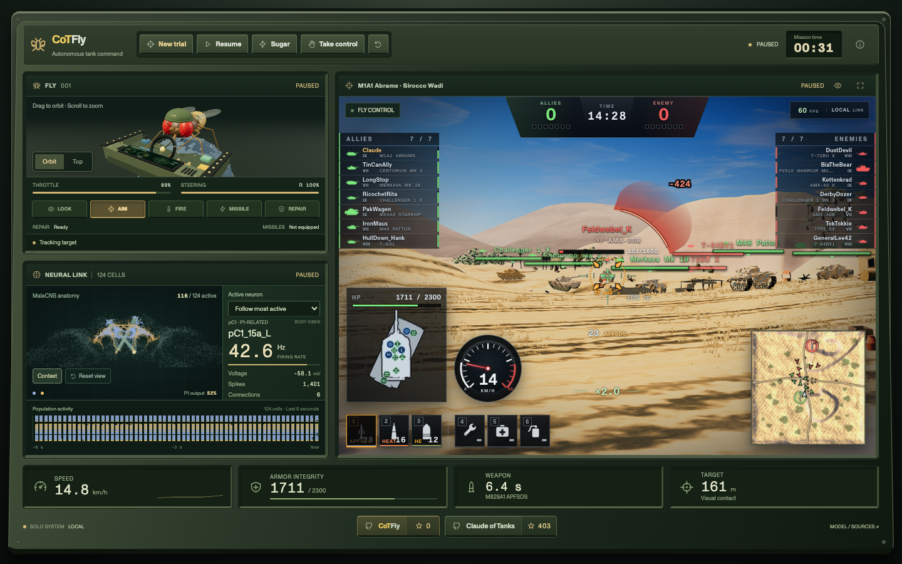
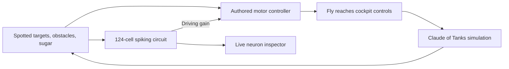

<div align="center">

# CoTFly

### Six legs. 124 neurons. One very questionable tank commander.

A fruit fly in a tiny tank helmet plays **Claude of Tanks** from its own miniature armored cockpit.

**[Launch a trial →](https://fly.kevinliu.studio/)** · [Original game](https://github.com/Kevin-Liu-01/claude-of-tanks) · [How the brain works](#inside-the-brain) · [Run locally](#run-locally)

[](https://github.com/Kevin-Liu-01/CoTFly/stargazers)


[](https://fly.kevinliu.studio/)

</div>

Pick a tank and a battlefield. Deploy the fly. Watch it turn the steering wheel, line up a shot through the scope, and reach out to press the fire button. Its neural activity updates beside the battle, while your tiny commander deals with ammunition, damaged modules, and the occasional wall.

Everything runs in your browser. No account, API key, or model server is needed to play.

## The console

| Instrument | What you can do |
| --- | --- |
| **Trial control** | Browse illustrated, searchable selectors for **171 vehicles and 30 maps**, then launch directly into a battle. |
| **Fly cockpit** | Orbit an original 3D fly with a tanker helmet, steering wheel, guarded controls, and moving legs. Physical contact gates aiming, firing, ammo changes, and repairs. |
| **Battle monitor** | Watch the actual Claude of Tanks simulation with its team lists, armor, modules, equipment, ammunition, speedometer, and minimap. The fly scopes in to aim and releases the fire button during reloads. |
| **Neural link** | Rotate the anatomical cluster, follow active cells, and inspect membrane voltage, firing rate, spike counts, and a six-second population raster. |
| **Pilot controls** | Pause the trial, give the fly a 15-second sugar boost, take control yourself, or repeat with a fresh pilot and brain state. |

The console fills the desktop viewport. On phones, **Battle / Pilot / Neural** tabs keep each display usable within the same compact dashboard.

## Inside the brain

CoTFly combines measured fly anatomy with an authored controller for tank combat. The neural simulation runs live and has a causal effect on the pilot's driving gain.

- **124 identified MaleCNS cells:** 75 mAL and 49 P1-related pC1 cells, selected from [Fruitless](https://github.com/nicodunks/fruitless).
- **1,106 measured anatomical connections:** original cell identities and synapse counts are retained.
- **Leaky integrate-and-fire dynamics:** voltage integration, thresholds, resets, refractory periods, and inhibitory signaling advance in deterministic **1 ms substeps**.
- **An authored 24-channel recurrent motor network:** converts spotted targets, obstacle sensing, and sugar state into steering, throttle, and firing intent.
- **Embodied controls:** foreleg contact, physical turret alignment, ammunition, and the game's normal action rules determine what actually happens.



The connectivity and displayed cell anatomy come from measured data. The physiological parameters, sensory encoding, inhibitory model, and tank-control mappings are game adaptations. This is a **reduced-circuit simulation**, not a whole-brain model or a claim about biological flies driving tanks. Dim background anatomy provides visual context; those points are not simulated cells.

Read the [implementation notes](docs/FLY-OF-TANKS.md) and [circuit provenance](src/fly/data/NOTICE.md) for the exact source revision, assumptions, and transformations.

## Run locally

Requires **Node.js 24** and npm.

```sh
git clone https://github.com/Kevin-Liu-01/CoTFly.git
cd CoTFly
npm ci
npm run dev
```

Open the local URL printed by Vite. `/` opens the console; legacy `/fly` links redirect to it. The same-origin battle runs at `/game.html` and is initialized by the console.

```sh
npm run test:fly    # Circuit, controller, actions, scope, and trial checks
npm run typecheck  # TypeScript and unused-code checks
npm run build      # Production build
npm run preview    # Serve the built app locally
```

## Explore the code

| Path | Responsibility |
| --- | --- |
| [`src/fly/main.ts`](src/fly/main.ts) | Console state, trial lifecycle, telemetry, and human takeover |
| [`src/fly/runtime.ts`](src/fly/runtime.ts) | Pilot integration, visible-target selection, scope decisions, and canonical game actions |
| [`src/fly/connectome.ts`](src/fly/connectome.ts) | Deterministic spiking circuit and population output |
| [`src/fly/controller.ts`](src/fly/controller.ts) | Sensing, recurrent motor control, obstacle recovery, and firing interlocks |
| [`src/fly/specimen.ts`](src/fly/specimen.ts) | Procedural fly, helmet, cockpit, and physical button presses |
| [`src/fly/brainView.ts`](src/fly/brainView.ts) | Anatomical neuron display, active-cell inspection, and spike history |
| [`src/fly/trialSetup.ts`](src/fly/trialSetup.ts) | Searchable tank and map selectors with previews |
| [`src/main.ts`](src/main.ts) | Embedded Claude of Tanks runtime |

The game advances at 60 Hz. Auxiliary views use batched, demand-driven rendering and skip hidden displays. Trial messages validate origin, source, and trial identity; the pilot only receives spotted enemies with clear sightlines.

The selector catalog is generated from game registries with `node tools/cotfly-catalog.mjs`. The fly checks verify registry parity and every preview asset. GitHub star counts use public repository metadata, with an hourly browser cache and a last-known-count fallback.

### Deploy

The included [Vercel configuration](vercel.json) runs fly tests, type checks, and the production build, then serves `dist`. The build publishes the console at `/` and the embedded battle at `/game.html`. The autonomous solo experience needs no environment variables. Inherited multiplayer services have separate configuration and are optional.

## Credits and provenance

Created by **Kevin B. Liu**. CoTFly builds on [Claude of Tanks](https://github.com/Kevin-Liu-01/claude-of-tanks), source snapshot `9cde7b8f0`. The game source remains in this repository so CoTFly can run independently, with its own console and pilot.

- **Circuit data:** [Fruitless](https://github.com/nicodunks/fruitless) and [MaleCNS](https://male-cns.janelia.org/), credited under CC BY 4.0 in the [data notice](src/fly/data/NOTICE.md).
- **Fly simulation inspiration:** [flybody](https://github.com/TuragaLab/flybody), [MuJoCo Menagerie](https://github.com/google-deepmind/mujoco_menagerie), and [NeuroMechFly](https://github.com/NeLy-EPFL/flygym).
- **Fly and cockpit geometry:** original procedural models created for CoTFly.

General code is MIT. Inherited game content includes explicit exceptions; consult [LICENSE-POLICY.md](LICENSE-POLICY.md), [LICENSE](LICENSE), and [third-party attribution](docs/ATTRIBUTION.md) before reusing assets. Existing notices and reserved-content terms are preserved.

If you enjoy watching a fly operate heavy machinery, [give CoTFly a star](https://github.com/Kevin-Liu-01/CoTFly) — and visit the [original Claude of Tanks](https://github.com/Kevin-Liu-01/claude-of-tanks).
